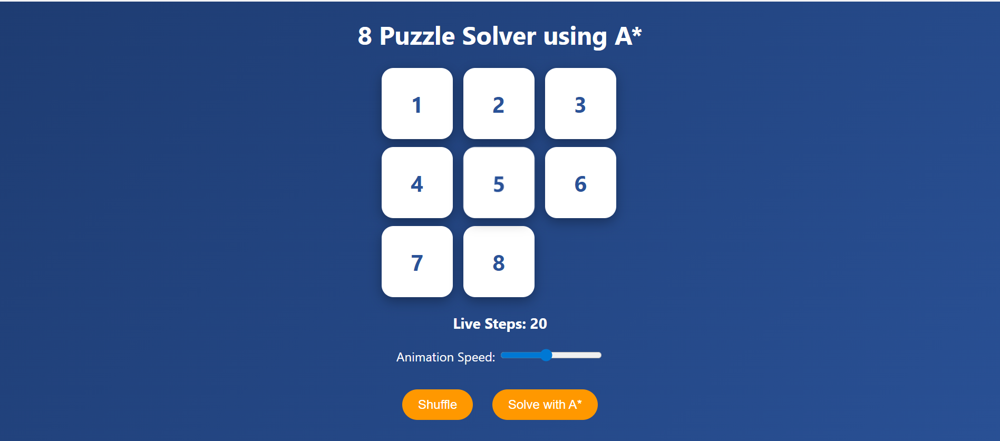

# 🧩 8 Puzzle Solver using A* Algorithm

An interactive **8-Puzzle Solver** built using **Python and Flask** that demonstrates how the **A* Search Algorithm** solves the puzzle optimally.

---

## 🚀 Overview

The **8-Puzzle Problem** is a classic Artificial Intelligence problem where numbered tiles are arranged in a 3×3 grid with one empty space.

The goal is to arrange the tiles in the correct order by sliding them into the empty space.

This project allows users to:

- Play the puzzle manually
- Solve it automatically using the **A\* algorithm**
- Visualize the optimal solution steps

---

## ✨ Features

- Interactive puzzle board
- Manual tile movement
- Automatic solving using A* algorithm
- Step-by-step solution animation
- Displays optimal moves
- Shows explored nodes
- Adjustable animation speed

---

## 🧠 Algorithm Used

This project uses the **A\* Search Algorithm**, which finds the shortest path to the goal.

The evaluation function used is:

f(n) = g(n) + h(n)

Where:

- **g(n)** = cost from start node to current node  
- **h(n)** = heuristic estimate to goal  

The heuristic used is **Manhattan Distance**, which calculates how far each tile is from its correct position.

---

## 🛠 Technologies Used

| Technology | Purpose |
|-----------|--------|
| Python | Backend logic |
| Flask | Web framework |
| HTML | Structure |
| CSS | Styling |
| JavaScript | Puzzle interaction |
| A* Algorithm | AI search technique |

---

## 📁 Project Structure
8-puzzle-a-star-solver
│
├── app.py
├── solver.py
│
├── templates
│ └── index.html
│
└── static
├── script.js
└── style.css

---

## ⚙️ How to Run

1️⃣ Install Python

2️⃣ Install Flask

pip install flask

3️⃣ Run the project

python app.py

4️⃣ Open browser and go to

http://127.0.0.1:5000

---

## 📸 Screenshots

### Puzzle Interface

### A* Solution Result

### Puzzle Interface

### A* Solution Result

---

## 👩‍💻 Author

**Swastika Gupta**

GitHub:  
https://github.com/swastika-1
